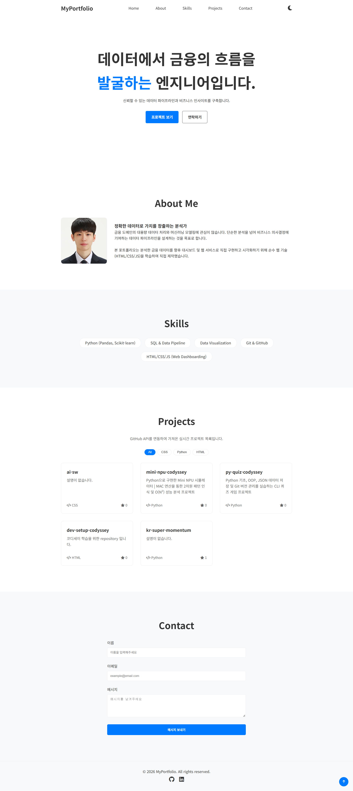
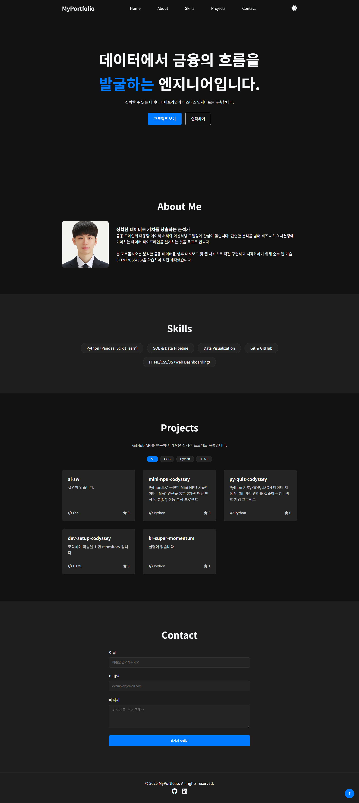
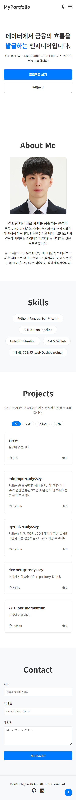
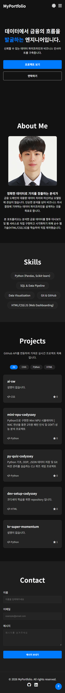

# 📊 Data Engineer Portfolio

<strong>금융 도메인의 문제를 데이터로 풀어가는 엔지니어입니다.</strong> 
금융 데이터의 수집·정제·분석과 신뢰할 수 있는 파이프라인 설계에 관심을 두고 있으며, 
데이터가 실제 의사결정과 서비스 경험으로 이어지는 과정을 고민합니다.

   
   
   
   

## 🔗 배포 및 확인
- **배포 URL:** [https://imyoman99.github.io/ai-sw/](https://imyoman99.github.io/ai-sw/) 
- **GitHub 저장소:** [https://github.com/imyoman99/ai-sw](https://github.com/imyoman99/ai-sw) 

---

## 🛠 사용 기술 (Tech Stack)
- **Markup:** HTML5 (Semantic Structure)
- **Style:** CSS3 (Flexbox & Grid, CSS Variables, Mobile-First Responsive Design)
- **Logic:** JavaScript (ES6+, Vanilla JS, Async/Await, DOM API)
- **Data Fetching:** GitHub REST API

---

## ✅ 요구사항 충족 체크리스트

### 프로젝트 기본 구성
- `index.html`, `css/`, `js/`, `images/` 폴더 구조로 분리했습니다.
- 외부 스타일시트와 JavaScript 파일을 HTML에서 연결했습니다.
- Live Server로 바로 확인할 수 있는 정적 웹사이트 구조입니다.

### HTML 구조
- `header`, `nav`, `main`, `section`, `article`, `footer`를 사용해 시맨틱하게 구성했습니다.
- Hero, About, Skills, Projects, Contact, Footer 섹션을 모두 포함합니다.
- 네비게이션 앵커 링크로 각 섹션에 바로 이동할 수 있습니다.
- 모든 이미지에 의미 있는 `alt` 속성을 넣었습니다.
- 폼 입력 요소는 `label for`와 `id`를 올바르게 연결했습니다.

### CSS 스타일링
- `:root` CSS 변수로 색상, 간격, 그림자, 전환값을 관리합니다.
- `[data-theme="dark"]`로 다크 모드 변수를 별도로 정의했습니다.
- 네비게이션은 Flexbox로, 프로젝트 카드는 Grid로 배치했습니다.
- 모바일 퍼스트로 작성했고 `768px`, `1024px` 브레이크포인트를 적용했습니다.
- 모바일에서는 햄버거 메뉴가 보이고, 큰 화면에서는 가로형 메뉴로 전환됩니다.
- 버튼과 카드에 hover, transition, shadow 효과를 넣었습니다.

### JavaScript 동작
- `defer`로 스크립트를 연결했습니다.
- `const`, `let`만 사용하고 `var`는 사용하지 않았습니다.
- `addEventListener` 기반으로 이벤트를 연결했습니다.
- DOM 조작은 `querySelector`, `querySelectorAll`로 요소를 선택하고, `classList`로 상태를 바꾸며, `innerHTML`과 `textContent`로 내용을 갱신하는 방식으로 구성했습니다.
- 폼 성공 메시지는 `textContent`를 사용해 사용자 이름을 안전하게 텍스트로만 출력합니다.
- click, submit, scroll, input 이벤트를 처리합니다.
- `preventDefault()`로 폼 기본 동작을 막고 커스텀 검증을 수행합니다.

### 인터랙션
- 햄버거 메뉴는 `classList.toggle('active')`로 동작합니다.
- 네비게이션 클릭 시 부드럽게 해당 섹션으로 이동합니다.
- 스크롤 300px 이상에서 상단 이동 버튼이 나타납니다.
- 스크롤 60px 이상에서 헤더 배경이 바뀝니다.
- 다크 모드 설정은 `localStorage`에 저장되어 새로고침 후에도 유지됩니다.
- `IntersectionObserver`로 스크롤 등장 애니메이션을 적용합니다.

### API 연동과 상태 처리
- GitHub API `https://api.github.com/users/{아이디}/repos`를 호출합니다.
- `fetch`, `async/await`, `try/catch`로 비동기 요청을 처리합니다.
- Projects 섹션은 로딩 / 성공 / 에러 / 빈 상태를 모두 화면에 표시합니다.
- `map()`으로 저장소 데이터를 카드 HTML로 변환합니다.
- `filter()`로 언어별 프로젝트 필터링을 지원합니다.
- `forEach()`로 이벤트 바인딩과 요소 순회를 처리합니다.

### 상태 관리 흐름
- 테마 토글: 이벤트 발생 → `STATE.theme` 변경 → 전체 화면 테마 갱신
- 프로젝트 요청: 요청 시작 → 로딩 상태 → 성공/에러/빈 상태 렌더링
- 폼 검증: 입력 제출 → 유효성 상태 변경 → 에러 메시지 표시/숨김
- 필터 버튼: 언어 선택 → 필터 상태 변경 → 프로젝트 목록 재렌더링

### 배포와 제출물
- GitHub Pages 배포 URL을 포함했습니다.
- 프로젝트 설명, 사용 기술, 배포 URL, 스크린샷을 README에 정리했습니다.
- 데스크톱 / 모바일 / 다크 모드 화면 이미지를 첨부했습니다.

---

## 🎤 평가 문항 답변

### 항목 1. 구현 기능과 동작 확인

- **반응형 레이아웃:** 기본 스타일을 모바일 기준으로 작성하고, `768px`와 `1024px` 미디어 쿼리에서 내비게이션과 프로젝트 Grid 레이아웃을 변경합니다. 브라우저 폭을 줄이면 데스크톱 메뉴가 햄버거 메뉴로 바뀌고, 프로젝트 카드가 한 열로 배치됩니다.
- **테마 전환:** `theme-toggle` 버튼의 `click` 이벤트에서 `STATE.theme`을 `dark` 또는 `light`로 바꾸고 `applyTheme()`을 호출합니다. 테마 값은 `localStorage`에 저장되므로 페이지를 다시 열 때 초기 상태로 읽어옵니다.
- **메뉴와 스크롤 기능:** 햄버거 버튼은 `.nav-menu`의 `active` 클래스를 켜고 끕니다. 스크롤 위치에 따라 헤더와 맨 위로 가기 버튼의 클래스를 변경하며, `IntersectionObserver`는 화면에 들어온 `.fade-in` 요소에 `appear` 클래스를 추가합니다.
- **GitHub API:** `fetchProjects()`가 API를 호출하기 전에 `loading` 상태를 저장하고, 응답 결과에 따라 `success`, `empty`, `error` 상태를 설정합니다. `renderProjects()`는 상태에 따라 로딩 화면, 프로젝트 카드, 빈 상태 또는 에러 화면을 표시합니다. 재요청을 시작할 때는 기존 필터를 비우고, 프로젝트 이름과 설명은 HTML 특수문자를 처리한 뒤 화면에 표시합니다.
- **폼 검사:** form의 기본 브라우저 검증을 끄고 제출 이벤트에서 이름의 공백 여부, 이메일 정규식, 메시지의 공백 여부를 확인합니다. 문제가 있는 입력에는 `invalid` 클래스를 추가하고 오류 문구를 표시하며, 입력이 다시 시작되면 해당 클래스를 제거합니다. 검증을 통과하면 실제 서버 전송 없이 입력 확인 메시지를 표시합니다.

### 항목 2. 파일 분리와 기본 구조

- **파일을 분리한 이유:** `index.html`은 문서 구조와 콘텐츠, `css/style.css`는 화면 스타일과 반응형 규칙, `js/main.js`는 상태 관리와 이벤트 및 렌더링 로직을 담당하도록 나누었습니다. 각 파일의 역할이 달라지므로 수정할 범위를 찾기 쉽고 구조와 동작을 구분해서 관리할 수 있습니다.
- **시맨틱 태그:** `header`에는 사이트 상단과 메뉴를, `nav`에는 페이지 이동 링크를, `main`에는 핵심 콘텐츠를, `section`에는 About·Skills·Projects·Contact 영역을, `footer`에는 하단 정보를 배치했습니다. 태그의 역할과 콘텐츠 영역이 일치하도록 문서 구조를 구성했습니다.
- **CSS 변수:** `:root`에 배경색, 글자색, 테두리색, 카드 배경색, 그림자, 포커스·오류·성공 색상, 전환 효과를 변수로 정의하고 다크 모드에서 필요한 값만 다시 지정했습니다. 같은 값을 여러 곳에서 사용할 때 한 곳에서 수정할 수 있고, 라이트·다크 테마의 차이를 관리하기 쉽습니다.
- **`addEventListener`와 인라인 이벤트:** `addEventListener`는 HTML 구조와 JavaScript 동작을 분리하고, 하나의 요소에 여러 이벤트를 연결하거나 이벤트를 코드에서 관리할 수 있습니다. 이 프로젝트의 테마, 메뉴, 스크롤, 폼, API 재시도 이벤트는 `addEventListener`로 연결했습니다.

### 항목 3. 코드 흐름과 자료 처리

- **이벤트 → 상태 변경 → 화면 업데이트 예시:** 테마 버튼을 클릭하면 `STATE.theme`을 변경하고 `localStorage`에 저장한 뒤 `applyTheme()`에서 `data-theme` 속성과 아이콘을 갱신합니다. API 필터 버튼도 클릭한 언어를 `STATE.projects.filter`에 저장한 후 `renderFilters()`와 `renderProjects()`를 다시 호출합니다.
- **`async/await`와 `try/catch`:** `fetchProjects()`는 `await fetch()`로 GitHub 응답을 기다립니다. `res.ok`가 false이면 에러를 발생시키고, 정상 응답이면 JSON을 읽어 프로젝트 데이터와 상태를 저장합니다. 네트워크 오류나 API 오류는 `catch`에서 `error` 상태로 바꾸고 재시도 UI를 표시합니다. 재시도 버튼은 `projects-container`의 이벤트 위임으로 처리합니다.
- **`filter`와 `map`:** 먼저 `filter()`로 선택한 언어에 해당하는 저장소만 추립니다. 이어서 `map()`으로 각 저장소의 이름, 설명, 언어, 별 개수를 HTML 카드 템플릿으로 변환하고 `projects-container`에 삽입합니다.
- **Flexbox와 Grid:** 헤더 내비게이션과 버튼처럼 한 방향으로 배치하는 요소에는 Flexbox를 사용했습니다. 프로젝트 카드처럼 여러 행과 열로 배치되는 목록에는 Grid의 `auto-fit`과 `minmax()`를 사용했습니다.

### 항목 4. 상태 관리와 모바일 퍼스트

- **`STATE` 객체를 사용하는 이유:** 테마, API 원본 데이터, 요청 상태, 오류 메시지, 필터 값을 하나의 객체에서 관리하면 이벤트 핸들러와 렌더링 함수가 같은 상태를 참조할 수 있습니다. 여러 개의 전역 변수로 나누는 것보다 어떤 값이 화면에 영향을 주는지 추적하기 쉽습니다. 이 프로젝트에서는 상태를 직접 변경한 뒤 관련 렌더링 함수를 호출하는 방식으로 사용합니다.
- **모바일 퍼스트를 선택한 이유:** 작은 화면에서 필요한 기본 레이아웃을 먼저 작성한 뒤 `768px`, `1024px` 미디어 쿼리에서 가로 메뉴, 버튼 정렬, 프로젝트 다중 열 레이아웃을 추가했습니다. 콘텐츠와 기본 동작을 먼저 구성하고 화면이 넓어질 때 배치를 확장하는 순서입니다.

---

## 📸 스크린샷 (Screenshots)

<table>
   <tr>
      <th colspan="2">데스크톱 화면</th>
   </tr>
   <tr>
      <td align="center">
          
         <strong>Light Mode</strong>
      </td>
      <td align="center">
          
         <strong>Dark Mode</strong>
      </td>
   </tr>
   <tr>
      <th colspan="2">모바일 화면</th>
   </tr>
   <tr>
      <td align="center">
          
         <strong>Light Mode</strong>
      </td>
      <td align="center">
          
         <strong>Dark Mode</strong>
      </td>
   </tr>
</table>

---

## ✨ 주요 기능 및 UI/UX 인터랙션

1. **GitHub API 동적 연동 및 상태 처리**
   - Fetch API를 이용해 실시간 프로젝트 목록을 동적으로 렌더링합니다.
   - API 요청 상태를 로딩 중 / 성공 / 실패(에러) / 빈 데이터로 나누어 각 상태에 맞는 UI를 표시합니다. 에러 상태에서는 "프로젝트를 불러올 수 없습니다." 메시지와 재시도 버튼을 보여줍니다.
2. **다크 모드 (Dark Mode)**
   - 테마 토글 버튼을 통해 라이트/다크 모드가 전환됩니다.
   - `localStorage`에 테마 설정을 저장하여 새로고침 후에도 같은 테마를 적용합니다.
3. **반응형 웹 디자인 (Responsive Design)**
   - 768px와 1024px 기준의 미디어 쿼리로 모바일, 태블릿, 데스크톱 레이아웃을 구성합니다.
   - 모바일 환경에서는 내비게이션이 숨겨지고 햄버거 메뉴(Hamburger Menu)가 활성화됩니다.
4. **폼 유효성 검사 (Form Validation)**
   - Contact 섹션에서 빈 필드 제출을 방지하고 이메일 정규식 패턴을 검증합니다.
   - 유효하지 않은 입력 시 즉각적인 에러 메시지(Immediate Feedback)를 노출합니다.
5. **스크롤 인터랙션 (Scroll Interactions)**
   - 내비게이션 앵커 링크 클릭 시 부드러운 스크롤(Smooth Scroll)로 이동합니다.
   - Intersection Observer를 활용한 요소 등장 애니메이션(Fade-in)을 구현했습니다.

---

## 📐 아키텍처 및 기술적 의사결정 (Technical Decisions)

본 프로젝트는 **'이벤트 → 상태 업데이트 → 렌더링'** 흐름을 중심으로 화면 동작을 구현했습니다.

### 1. 단일 진실 공급원(SSOT) 기반의 상태 관리
테마 설정, API 원본 데이터, 필터링 상태, 에러 메시지를 `STATE` 객체에서 관리했습니다.
- **흐름:** 사용자의 클릭(Event) 발생 ➔ `STATE` 객체의 데이터 갱신(State Update) ➔ 갱신된 데이터를 바탕으로 화면 재조립(Render). 
- 상태가 변경되면 해당 상태를 기준으로 필터 버튼과 프로젝트 목록을 다시 렌더링합니다.

### 2. 비동기 데이터 처리와 예외 통제 (`async/await`, `try/catch`)
외부 GitHub API를 `async/await`와 `try/catch`로 호출하고 응답 상태에 따라 화면을 분기했습니다.
- `!res.ok`인 응답은 에러로 처리하고, `catch`에서 에러 메시지와 재시도 버튼을 렌더링합니다.

### 3. 데이터 전처리를 위한 배열 메서드 (`map`, `filter`)
- API로 수신한 JSON 배열 데이터에서 `filter()`를 이용해 특정 언어(Language) 조건에 맞는 데이터 서브셋(Subset)을 추출했습니다.
- 이후 `map()` 메서드를 활용해 각 데이터 객체를 HTML 템플릿 리터럴로 치환하여 DOM에 주입했습니다. 프로젝트 이름·설명·언어·별 개수는 `escapeHtml()`로 처리하고, 저장소 주소는 `getSafeRepositoryUrl()`에서 HTTPS GitHub 주소인지 확인합니다.

### 4. 시맨틱 마크업과 관심사의 분리
- `<header>`, `<main>`, `<section>`, `<footer>` 등 시맨틱 태그로 문서 구조를 구성했습니다.
- HTML 인라인 이벤트 대신 JavaScript의 `addEventListener`로 사용자 이벤트를 연결했습니다.

### 5. Layout & Styling: Flexbox vs Grid, CSS Variables
- **Flexbox & Grid:** 내비게이션에는 Flexbox를, Projects 카드 목록에는 Grid(`auto-fit`, `minmax`)를 사용해 화면 크기에 따라 레이아웃이 바뀌도록 구성했습니다.
- **CSS Variables & Mobile-First:** 색상 값을 `:root` 변수로 관리하고, 모바일 기본 스타일에 미디어 쿼리를 추가하는 방식으로 레이아웃을 구성했습니다. 키보드 포커스 표시, 섹션 앵커 위치 보정, 입력창 크기 조절 스타일도 CSS로 지정했습니다.

---

## ⚙️ 주요 애니메이션 임계값 설정 (Thresholds)
프로젝트 내 구현된 주요 인터랙션의 임계값 기준은 다음과 같습니다.
- **스크롤 탑 버튼 표시 기준:** `window.scrollY > 300px`
- **내비게이션 배경색 변경(Scrolled) 기준:** `window.scrollY > 60px`
- **Intersection Observer 등장 애니메이션:** `threshold: 0.2` (요소가 화면에 20% 노출될 때 실행)

---

## 💡 회고 및 향후 계획
금융 데이터의 수집과 모델링에 집중하던 관점에서 벗어나 분석된 데이터가 클라이언트 단(Front-end)에서 어떻게 상태로 관리되고 화면에 매핑되는지 그 본질을 깊이 이해할 수 있었습니다.
이 포트폴리오를 기반으로, 향후 Python으로 분석한 금융 데이터를 DB에 적재하고, 이를 API로 끌어와 실시간 렌더링하는 **풀스택 데이터 대시보드 웹 서비스**로 확장해 나갈 계획입니다.